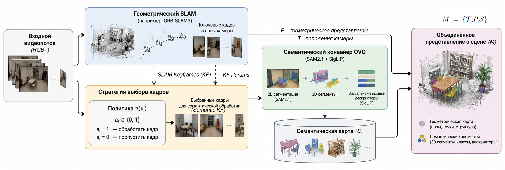
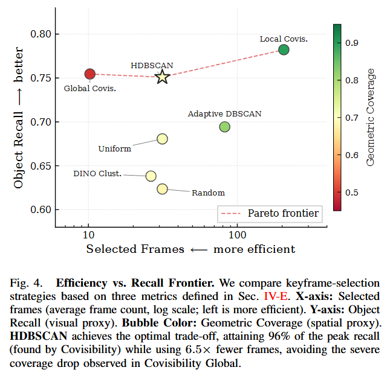

# Адаптивный выбор ключевых кадров для Open-Vocabulary Semantic SLAM

**[Полный текст исследовательской работы (PDF)](docs/research.pdf)** | **[Инструкция по установке](SetupGuide.md)**

## Описание исследования

Одним из способов повышения вычислительной эффективности семантического картирования с открытым словарём является выбор ограниченного набора информативных ключевых кадров для семантической обработки. При этом сокращение числа обрабатываемых кадров может приводить к потере информации об отдельных объектах и снижениюполноты и точности семантической карты. В связи с этим актуальной является задача разработки и исследования методов адаптивного выбора ключевых кадров, позволяющих сократить вычислительные затраты при сохранениитребуемогокачествасемантического представления окружающей среды.

**Цель исследования** — разработка и экспериментальная оценка методов адаптивного выбора ключевых кадров для снижения вычислительных затрат при построении трёхмерных семантических карт с открытым словарём.

**Гипотеза:** адаптивный выбор кадров на основе их информативности и текущего состояния карты позволяет сократить количество запусков нейросетевых моделей по сравнению с периодическим выбором кадров при сохранении сопоставимого качества семантического представления окружающей среды.

## Математическая постановка задачи

Требуется определить стратегию $\pi^*$, минимизирующую суммарную вычислительную стоимость семантической обработки:

$$
\pi^*=
\arg\min_{\pi}
\sum_{i=0}^{\tau} C_{\mathrm{sem}}(a_i),
$$

где $a_i\in\{0,1\}$ — решение о передаче кадра на семантическую обработку, а $C_{\mathrm{sem}}(a_i)$ — вычислительные затраты, связанные с принятым решением.

При предположении приблизительно постоянной стоимости обработки одного выбранного кадра задача сводится к минимизации количества кадров, направляемых на семантическую обработку:

$$
\pi^*=
\arg\min_{\pi}|K_\pi|,
$$

где $K_\pi=\{f_i\in V\mid a_i=1\}$ — множество кадров, выбранных стратегией $\pi$.

Минимизация выполняется при условии сохранения заданного качества семантического представления:

$$
Q_{OV}(M_\pi)\geq Q_{OV}^{\min},
$$

где:

- $M_\pi$ — карта, построенная с использованием выбранного множества кадров $K_\pi$;
- $Q_{OV}$ — показатель качества семантического представления, оцениваемый по точности семантической сегментации и сопоставления пространственных элементов с текстовыми запросами;
- $Q_{OV}^{\min}$ — минимально допустимое качество, устанавливаемое экспериментально на основе эталонной конфигурации с избыточным количеством обрабатываемых кадров.

Для обеспечения применимости метода в онлайн-системах выбор кадров должен выполняться последовательно, с использованием информации, доступной на момент принятия решения. Вычислительно затратная семантическая обработка осуществляется асинхронно относительно основного контура отслеживания камеры.

[**Обзор существующих решений**](./docs/literatura.md)

## Описание базового решения

В качестве базовой архитектуры для проведения исследования выбран [OVO — Open-Vocabulary Online Semantic Mapping for SLAM](https://github.com/tberriel/OVO), обеспечивающий построение трёхмерного семантического представления с открытым словарём на основе RGB-D ключевых кадров геометрического SLAM.

Модульная архитектура OVO позволяет исследовать стратегии выбора кадров для семантической обработки независимо от алгоритма оценки траектории камеры. При этом для экспериментальной оценки могут использоваться как оценённые положения камеры, так и ground-truth траектории датасетов.

Предлагается дополнить существующую архитектуру модулем адаптивного выбора ключевых кадров для нейросетевой семантической обработки. Модуль принимает последовательность кадров и информацию о состоянии системы, оценивает информативность наблюдений и определяет необходимость их передачи в семантический конвейер. При этом используемые модели сегментации и извлечения визуально-языковых признаков остаются неизменными.

*Рисунок 1 — Общая архитектура адаптивного выбора кадров для семантической обработки.*

На вход системы поступает последовательность кадров $V=\{f_0,\ldots,f_\tau\}$, где каждый кадр содержит RGB-изображение, данные глубины и, при наличии, дополнительные сенсорные измерения.

SLAM-модуль оценивает положения камеры $T_i\in SE(3)$ и формирует геометрическое представление среды $P$. Семантическая обработка выполняется асинхронно, а стратегия $\pi(x_i)$ определяет необходимость обработки очередного кадра на основании доступной информации.

Результатом работы является метрико-семантическая карта:

$$
M=\{\mathcal{T},P,\mathcal{S}\},
$$

где $\mathcal{T}$ — множество оценённых положений камеры, $P$ — геометрическое представление среды, $\mathcal{S}$ — множество семантических элементов карты.

Каждый семантический элемент определяется как:

$$
s_j=(G_j,d_j),
$$

где $G_j$ — геометрическое представление элемента, а $d_j\in\mathbb{R}^{D}$ — его визуально-языковой дескриптор.

На данном этапе будет проварьирована частота используемых кадров, путем изменения шага между кадрами, поступающих в алгоритм семантической сегментации. В перспективе можно проверить результаты, полученные в статье KeySG, показанные на рисунке 2. Авторы предлагают кластеризацию поз камеры посредством HDBSCAN[8] и сравнивают её с шестью стратегиями: равномерной и случайной выборкой, кластеризацией визуальных признаков DINOv2 [9], адаптивным DBSCAN, локальной и глобальной оптимизацией совместной видимости объектов. Можно рассмотреть использование данных методов для online-подхода.

  

*Рисунок 2 — сравнение стратегий выбора ключевых кадров из статьи KeySG.*

## Экспериментальные исследования

Экспериментальные исследования направлены на сравнение различных стратегий выбора ключевых кадров по вычислительной стоимости и качеству формируемого семантического представления.

В качестве базовой системы используется OVO с неизменными моделями сегментации и извлечения визуально-языковых признаков. Для обеспечения сопоставимости результатов эксперименты проводятся на одинаковых входных последовательностях и при фиксированных параметрах семантического конвейера.

### Экспериментальное окружение

Эксперименты выполняются в программном окружении на основе Python, PyTorch и CUDA с использованием реализации OVO.

Подробные инструкции по установке зависимостей, подготовке окружения, загрузке моделей и запуску базовой системы приведены в **[SetupGuide.md](SetupGuide.md)**.

Для оценки предполагается использовать датасет Replica, содержащий RGB-D последовательности, трёхмерную геометрию и семантическую разметку сцен.

Основные измеряемые показатели:

- **Количество обработанных кадров** $|K_\pi|$.
- **Вычислительная стоимость** — время обработки, GPU time и потребление памяти.
- **Качество семантической карты** — mIoU и mAcc.
- **Относительное сокращение вычислительных затрат** по сравнению с базовой стратегией.

### Эксперимент 1. Исходная стратегия OVO

В первом эксперименте исследуется исходная конфигурация OVO с периодическим выбором одного кадра из каждых десяти. Выполняются измерения времени работы отдельных этапов семантического конвейера, количества обработанных кадров, потребления вычислительных ресурсов и итогового качества семантической карты. Полученные результаты используются как базовая линия для последующего сравнения адаптивных стратегий.

**[Описание эксперимента и результаты](experiments\exp01_replica_office0_fixed10\README.MD)**

### Эксперимент 2. Периодический выбор кадров с различным интервалом

Исследуется зависимость качества семантической карты и вычислительных затрат от частоты передачи кадров на обработку. Для этого выполняются запуски OVO с различными значениями интервала выбора кадров. Эксперимент позволяет определить характер зависимости между количеством наблюдений, качеством реконструкции и вычислительной стоимостью, а также сформировать эталонную конфигурацию с избыточным числом кадров.

**[Описание эксперимента и результаты](experiments\exp02_replica_office0_5-20frames\README.MD)**

Подробное описание экспериментов - [здесь](./experiments/README.md)

## Используемые работы

1. Martins T. B., Oswald M. R., Civera J. *Open-Vocabulary Online Semantic Mapping for SLAM*. 2025. [Статья](https://arxiv.org/abs/2411.15043) | [GitHub](https://github.com/tberriel/OVO).

## Выводы

В ходе работы проведён анализ современных методов одновременной локализации и картографирования с открытым словарём, рассмотрены особенности их архитектуры, способы формирования метрико-семантического представления среды и подходы к интеграции нейросетевых моделей. На основе проведённого анализа сформулирована концепция адаптивного использования нейросетевых моделей, предполагающая изменение режима семантической обработки в зависимости от информативности поступающих наблюдений и состояния карты. Определены основные критерии оценки эффективности подхода, включающие качество семантического представления, вычислительные затраты и характеристики локализации.

Результаты аналитического и экспериментального исследования подтверждают целесообразность дальнейшего изучения методов выбора информативных кадров для повышения вычислительной эффективности семантического картографирования. В качестве следующего этапа предполагается исследовать геометрическую и семантическую информативность наблюдений, а также неопределённость формируемой карты как критерии адаптивного управления вычислительными ресурсами. Основной задачей дальнейшей работы является разработка и экспериментальная оценка адаптивной стратегии, обеспечивающей снижение вычислительных затрат при сохранении заданного качества локализации и семантического представления среды.
