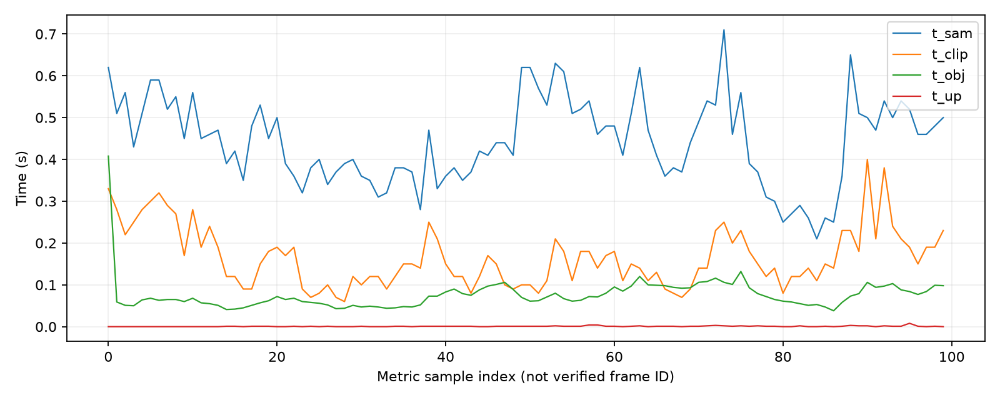
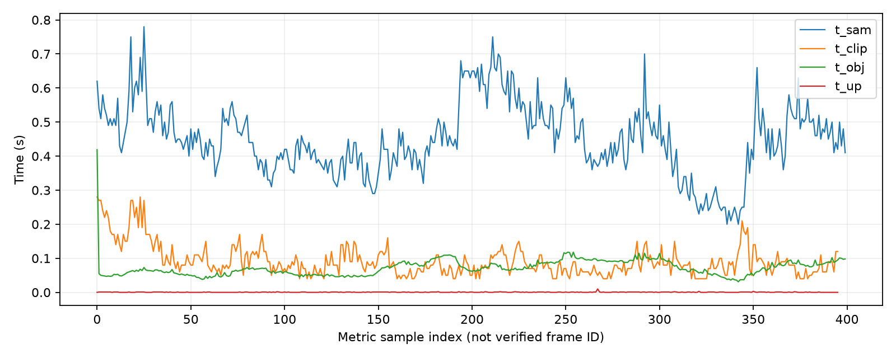

# Эксперимент 2. Влияние периодичности обработки

## Цель

Оценить влияние `segment_every=5`, `10` и `20` на качество карты и вычислительную стоимость. Во всех запусках используются 2000 кадров Replica `office0`, `map_every=5` и одинаковые остальные параметры.

## Результат

| Показатель | Fixed-5 | Fixed-10 | Fixed-20 |
|---|---:|---:|---:|
| Обработано кадров | 400 | 200 | 100 |
| Доля входных кадров, % | 20 | 10 | 5 |
| mIoU, % | 22.80 | 24.90 | 26.70 |
| mAcc, % | 30.60 | 32.80 | 35.60 |
| f-mIoU, % | 47.10 | 42.00 | 48.60 |
| f-mAcc, % | 60.30 | 54.00 | 61.60 |
| Суммарное время семантики, с | 245.330 | 128.867 | 68.465 |
| Средняя стоимость семантического шага, с | 0.613 | 0.644 | 0.685 |
| SAM P95, с | 0.650 | 0.640 | 0.620 |
| Пиковая VRAM, ГБ | 11.51 | 11.53 | 11.54 |

Покадровое время обработки для шага в 20 кадров  показано на рисунке ниже:

*`t_sam`- время сегментации `t_obj` - время сопоставления объектов `t_clip`- время извлечения признаков `t_up` - время обновления дескрипторов*

Покадровое время обработки для шага в 5 кадров  показано на рисунке ниже:

*`t_sam`- время сегментации `t_obj` - время сопоставления объектов `t_clip`- время извлечения признаков `t_up` - время обновления дескрипторов*

Fixed-20 сократил время семантики на 46.9% относительно Fixed-10 и на 72.1% относительно Fixed-5. mIoU вырос соответственно на 1.80 и 3.90 процентного пункта.

## Вывод

На данной сцене Fixed-20 обеспечил лучшие значения всех метрик при минимальных суммарных затратах. Сокращение затрат связано преимущественно с меньшим количеством обработанных кадров; пиковая VRAM практически не меняется. Результат мотивирует исследование адаптивного отбора, но не доказывает его преимущество и требует проверки на других сценах.